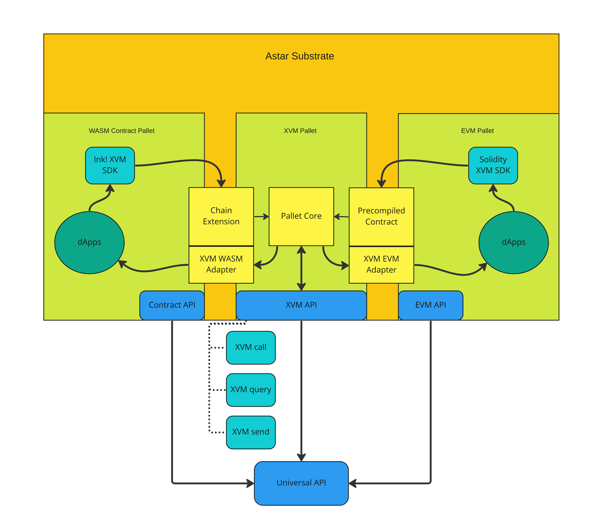

# Sub0 XVM Contract Demo App

## Introduction

This repository contains the full project for the Sub0 developer conference workshop.
The demo will focus on controlling an EVM ERC20 tokens from a Substrate native account.
With XVM, we can create a developer environment where projects can reside either in EVM with Ethereum signers or WASM contract with Substrate native signers.

Because we are controlling the ERC20 tokens in the EVM environment from a native account, we will extensively use the [EVM mapped address](https://medium.com/astar-network/using-astar-network-account-between-substrate-and-evm-656643df22a0), which does not have a direct signer attached to it.

## Architecture

XVM (Cross-Virtual Machine) takes a very straight-forward approach to interoperability as XVM is completely synchronous in the same chain.

For the call to work, we encode the arguments that are passed to a smart contract function and feed them to the chain extension.
The chain extension will communicate with the XVM core and send the message to the correct VM adapter with the corresponding ID.
That is when the contract is executed on chain.

## Prerequisites and Preparation

This demo is made with Debian Linux in mind, but the same requirements should apply to any Unix variant OS like macOS.

1. Install [Rust](https://www.rust-lang.org/tools/install)
2. Install [Cargo Contract](https://github.com/paritytech/cargo-contract)
3. Install npm (I recommend using [NVM](https://github.com/nvm-sh/nvm))
4. Install an Ethereum wallet and a Substrate wallet to your browser (we will use MetaMask and Talisman on Firefox for this example)
5. Clone the [Astar collator node](https://github.com/AstarNetwork/Astar/tree/feature/pallet-xvm-v2) and check out the `feature/pallet-xvm-v2` branch
6. Build the Astar collator node using `cargo build --release`
7. Run the Astar collator in a local dev mode with the `--dev --tmp` flag
8. (Optional) Clone the [ink XVM SDK](https://github.com/AstarNetwork/ink-xvm-sdk) repository and build the contract using `cargo contract build` (note that you have to build directly from the contract folder like `erc20` or `psp22-controller`). Because this demo repository contains the pre-compiled contract binaries, this step is optional
9. Import the EVM developer account private key `0x01ab6e801c06e59ca97a14fc0a1978b27fa366fc87450e0b65459dd3515b7391` to your Ethereum wallet

Once you confirm that your collator is running in dev mode, your Ethereum wallet is connected to the local network, and you successfully imported the EVM dev account that is fully funded, you should be ready to go.
